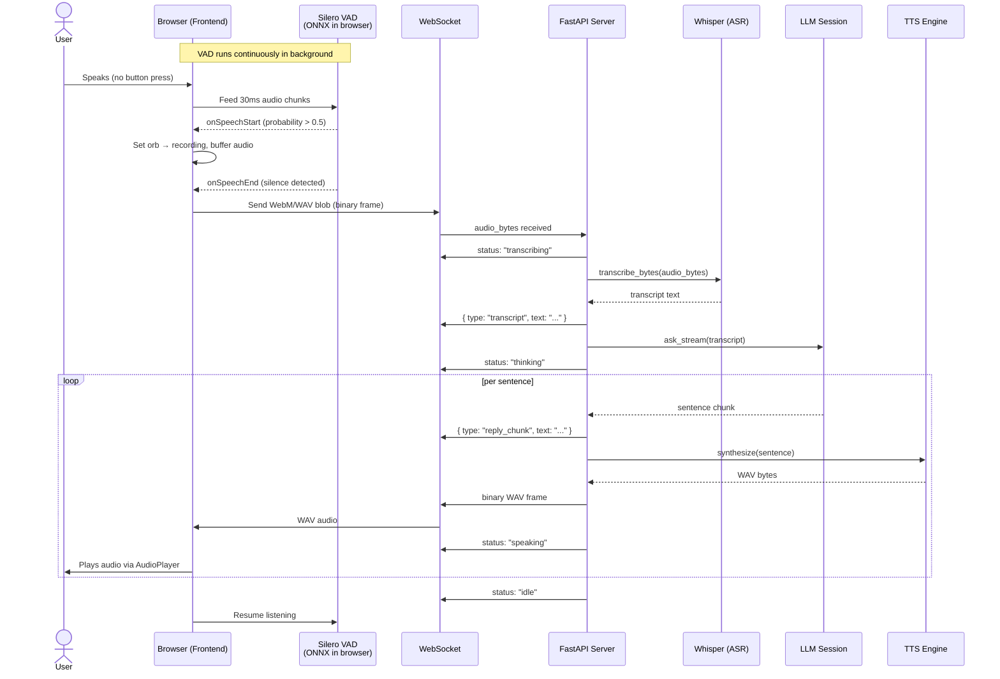

# Mekho

Mekho is a simple Voice Assistant designed to provide a layer of interaction over various AI models and modules. It serves as a lightweight and extensible platform for voice-based AI interactions.

## How it works:

Mekho acts as a bridge between the user and underlying AI models, enabling voice-based commands and responses. It integrates multiple AI modules to deliver a seamless experience.

## Installation

1. Clone the repository:
   ```bash
   git clone https://github.com/mokhtarHamdoune/mekho
   cd Mekho
   ```
2. Set up a virtual environment:
   ```bash
   python3 -m venv venv
   source venv/bin/activate
   ```
3. Install the dependencies:
   ```bash
   pip install -r requirements.txt
   ```

## Run server

To start the server, run the following command:

```bash
uvicorn server.main:app
```

The server will start, and you can interact with Mekho through its voice interface.

## Objectives

- Turn the assistant into an action-capable voice agent.
- Keep the architecture simple enough to evolve.
- Preserve a clear boundary between model, backend, and frontend.

## Agent Progress

- [x] **important!** Voice Mode
- [x] **important!** Tools Support ( Contract + Registry)
- [x] **important!** Voice Activity Detector
- [] **important!** Support Arabic (Algerian, Moroccan , Gulf)
- [] New Session Action
- [] Support French

## Tools Progress:

### Shopping Cart Tool

- [x] Adding An Item To Shopping Cart
- [x] Removing An Item From Shopping Cart
- [] Possible Current Cart State For The LLM (We may need to store the state after each change)

### Catalog Tool

- [x] Search Product Tool
- [x] Product Details Tool
- [] Simple Product Recommendation Tool

## Checkout Tool

- [] Simple Order Confirmation Tool That Close The Loop and

## Sequence diagram


